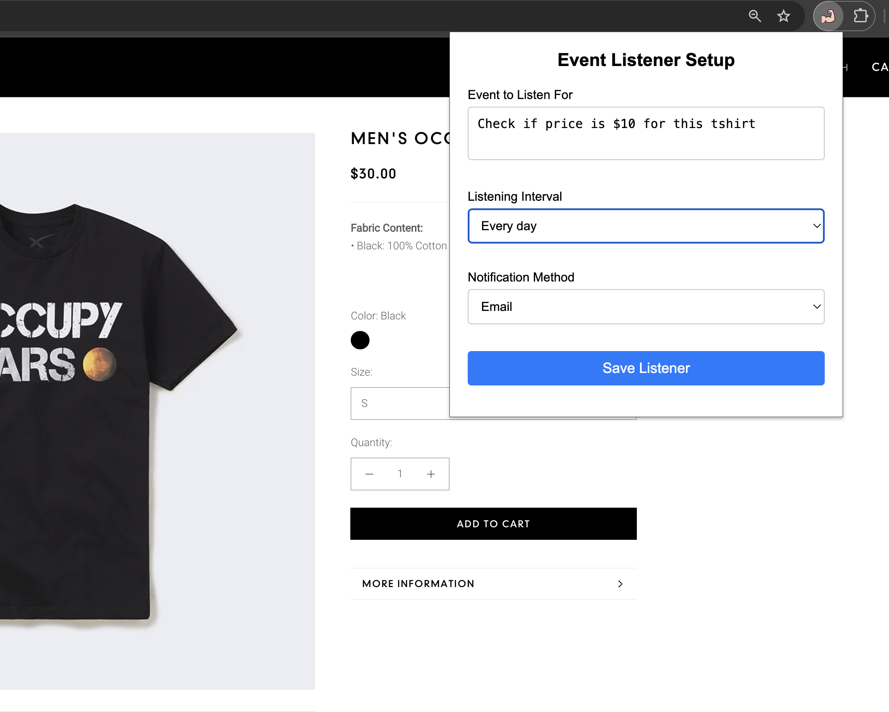

# Event Listener 

Keep eye on specific events on websites with help of AI agents and get notified when those events occurs.

> **Note**: This project was developed during the Supabase AI Hackathon (November 23-24, 2024). It leverages Scrapybara for website monitoring and automatically triggers email notifications via the Resend API when specified events occur on monitored websites. All user-requested events are securely stored in Supabase.

## ✨ Features
- Event Monitoring: Specify events to monitor on any website.
- Custom Intervals: Choose how frequently the event should be checked.
- Email Notifications: Receive an email when the event occurs.

### Screenshots

### Video Tutorial
https://youtu.be/8Q9kCN4nhu0?si=IuZi9_QVtBlPZw4A

